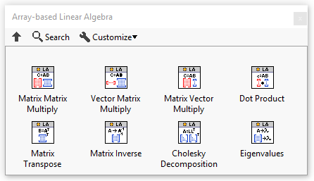
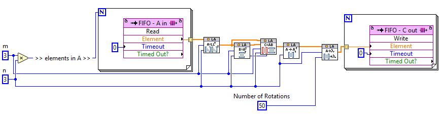

# LabVIEW-FPGA-Array-Based-Linear-Algebra
A library of array-based linear algebra solvers for LabVIEW FPGA designed for ease of use over efficiency or timing.

The provided palette has functions for 
- Matrix-matrix multiply
- Vector-matrix multiply
- Matrix-vector multiply
- Dot-product
- Matrix inverse
- Matrix transpose
- Cholesky Decomposition
- Eigenvalue 

All functions except the eigenvalue are polymorphic and can take both single precisions floating data type and fixed-point data points up to a word length of 12 and integer word length of 32. Note that the eigenvalue function only supports single precisions floating point.

These functions enable array-based deployment of algorithms to FPGAs. Arrays are stored in the look-up tables (LUT) for ease of implementation. 

## How do I install this?
Click [Releases](https://github.com/ARTS-Laboratory/LabVIEW-FPGA-Array-Based-Linear-Algebra/releases) on the right-hand side of the screen and download the latest release. The .vip file is what you want and is called "arts_lab_lib_array_based_linear_algebra-x.x.x.x.vip". You can install .vip files through NI's VIPM Browser. 

## [Development workspace](development_workspace)
Houses all the code used in building and developing the functions, including test deployments to FPGAs. 

## [Package](package)
Houses the published packages.

## Licensing and Citation

[![CC BY-SA 4.0][cc-by-sa-shield]][cc-by-sa]

This work is licensed under a
[Creative Commons Attribution-ShareAlike 4.0 International License][cc-by-sa].

[cc-by-sa]: http://creativecommons.org/licenses/by-sa/4.0/
[cc-by-sa-image]: https://licensebuttons.net/l/by-sa/4.0/88x31.png
[cc-by-sa-shield]: https://img.shields.io/badge/License-CC%20BY--SA%204.0-lightgrey.svg

Cite as:

@Misc{Downey2021LabVIEWFPGAArray,   
  author = {Austin Downey},   
  howpublished = {GitHub},  
  title  = {Lab{VIEW} {FPGA} Array-based Linear Algebra},   
  year   = {2021},  
  groups = {{ARTS-L}ab},    
  url    = {https://github.com/ARTS-Laboratory/LabVIEW-FPGA-Array-Based-Linear-Algebra},    
}

