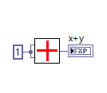

# Matrix Multiply workspace
1. The goal is to build an FPGA-deployable matrix function that handles real numbers in array format. 
1. Matrix to array conversion uses the standard LabVIEW column by row approach. 

## Icons
1. Has a glyph of the icon. The bottom half is transparent so you can add it on top of existing icons. 

## Matrix Matrix Multiply 

### v1.1
1. A working code, with lots of debug items on the front panel. 
1. Done if SGL floating point

### v1.2
1. Breaks out the nested for loops into a sub VI, the control statement calls the matrix_multiply function. 
1. Created separate folders for pure LabVIEW and LabVIEW-FPGA. 
1. The LabVIEW-FPGA was run on a cRIO-9035 to check functionality. 
1. The for loop to make C could be a called array, but I like to be able to change the size without clicking on the array properties. 
4. A basic device utilization investigation was undertaken, the results are below. 

### v1.3
1. Cleaning up the code. 
1. Change the code so C matrix is generated inside the function.
1. updated icon.
1. I worked a little bit on creating an FXP version of this code. 
1. I looked at a malleable VI, but it seems I can only manipulate items inside an object-based array.
 
### v1.4
1. This is a polymorphic version of 1.3
1. Created the following versions for the polymorphic VI
	- SGL 
	- FXP 32 16; signed, word length 32 bits, integer work length 16 bits, range -32768 to 32767, delta 1.52588E-5
	- FXP 16 8; signed, word length 16 bits, integer word length 8 bits, range -128 to 128, delta 0.00390625
	- FXP 16 4; signed, word length 16 bits, integer word length 4 bits, range -8 to 8, delta 0.000244141
1. The SGL is the base code, the FXP code is all built on top of that. 
1. The polymorphic approach works, but we have to build a version for each type of FXP, but for now, this may work. This has to be done for each function in the library. 	
1. Updated the icon on just the SGL format one. 

### v1.5
1. This is a polymorphic version of 1.3 using scripting to generate the code. 
1. I worked on "scripting build FXP VIs" for hours, but could not find a way to edit the addition function to change the output. I could get to it in the for loops but could hot figure out how to edit it. Due to this, I decided to just make another base-version version of the code for FXP and use that to make all the FXP combinations. 

### v1.6
1. This is a polymorphic version of 1.3 using scripting to generate the code. 
1. This code has an FXP version of the FLT-SGL version. This is the one that is edited via scripting to make all the variations. 
1. To get FXP to work around the accumulator, I had to add FXP conversions to the input of the accumulator that is tied to the variable "accum" that sets the data type for the accumulator. All FXP conversions are truncated and wrapped so they don't consume any FPGA resources. 
1. Run the code in the following order:
	1. scripting_build_FXP_VIs
	1. scripting_build_polymorphic_VIs
1. I think this code is working, but it would be nice to clean up the accumulator mess. Maybe make a sub-VI out of it.

## Vector Matrix Multiply 
### v1.1
1. This version is built off of matrix-matrix multiply v1.2 and simplified as needed to generate a vector-matrix multiply code. 
1. Done if SGL floating point.
1. Change the code so C matrix is generated inside the function. 
1. The input matrix is a 1D array of n, this could also be seen as an [1 x n] matrix. 
1. This only has an FPGA version of the code. 
1. Generally, this code was cleaned up a bit and changes were pushed back to Matrix Matrix Multiply v1.3.
### v1.2
1. This is a polymorphic version of 1.1 using scripting to generate the code. 
1. This code has an FXP version of the FLT-SGL version. This is the one that is edited via scripting to make all the variations. 
1. To get FXP to work around the accumulator, I had to add FXP conversions to the input of the accumulator that are tied to the variable "accum" that sets the data type for the accumulator. All FXP conversions are truncate and wrap so they don't consume any FPGA resources. 
1. Run the code in the following order:
	1. scripting_build_FXP_VIs
	1. scripting_build_polymorphic_VIs
1. I think this code is working, but it would be nice to clean up the accumulator mess. Maybe make a sub-VI out of it.

## Matrix Vector Multiply 
### v1.1
1. This version is built off of matrix matrix multiply v1.3 and simplified as needed to generate a matrix vector multiply code. 

### v1.2
1. This is a polymorphic version of 1.1 using scripting to generate the code. 
1. This code has an FXP version of the FLT-SGL version. This is the one that is edited via scripting to make all the variations. 
1. To get FXP to work around the accumulator, I had to add FXP conversions to the input of the accumulator that are tied to the variable "accum" that sets the data type for the accumulator. All FXP conversions are truncate and wrap so they don't consume any FPGA resources. 
1. Run the code in the following order:
	1. scripting_build_FXP_VIs
	1. scripting_build_polymorphic_VIs
1. I think this code is working, but it would be nice to clean up the accumulator mess. Maybe make a sub-VI out of it.

## Dot Product 
### v1.1
1. This version is built off of matrix matrix multiply v1.3 and simplified as needed to generate a dot product code. 
### v1.2
1. This is a polymorphic version of 1.1 using scripting to generate the code. 
1. This code has an FXP version of the FLT-SGL version. This is the one that is edited via scripting to make all the variations. 
1. To get FXP to work around the accumulator, I had to add FXP conversions to the input of the accumulator that are tied to the variable "accum" that sets the data type for the accumulator. All FXP conversions are truncate and wrap so they don't consume any FPGA resources. 
1. Run the code in the following order:
	1. scripting_build_FXP_VIs
	1. scripting_build_polymorphic_VIs
1. I think this code is working, but it would be nice to clean up the accumulator mess. Maybe make a sub-VI out of it.

## Matrix Transpose
### v1.1
1. Matrix transpose, also updates m and n in the function for matrix A.
### v1.2
1. This is a polymorphic version of 1.1 using scripting to generate the code. 
1. This code has an FXP version of the FLT-SGL version. This is the one that is edited via scripting to make all the variations. 
1. To get FXP to work around the accumulator, I had to add FXP conversions to the input of the accumulator that are tied to the variable "accum" that sets the data type for the accumulator. All FXP conversions are truncate and wrap so they don't consume any FPGA resources. 
1. Run the code in the following order:
	1. scripting_build_FXP_VIs
	1. scripting_build_polymorphic_VIs
1. I think this code is working, but it would be nice to clean up the accumulator mess. Maybe make a sub-VI out of it.

## Eigenvalue (Jacobi eigenvalue algorithm)
### v1.1
1. This is all the files related to solving the generalized eigenvalue problem on FPGAs using a Cholesky decomposition approach
1. Solving the generalized eigenvalue problem is done by a two step generalized eigenvalue solver
	- Cholesky decomposition to create a symmetric reduction of the A and B matrix.
	- Jacobi eigenvalue algorithm to solve the reduced problem.
1. Slides are in the folder that show the preliminary work on this.

### v1.2
1. Cut out all the Cholesky work, focused on building just the Jacobi solution.
1. Jacobi eigenvalue algorithm, not to be confused with the Jacobi method which is an iterative algorithm for determining the solutions of a strictly diagonally dominant system of linear equations.
1. The Jacobi eigenvalue algorithm solves for the eigenvalues of a matrix.
1. There is a working Python code with 1D arrays.
1. There is a working LabVIEW code with Matrices (2D array). 
1. Need to generate a 1D implementation of the LabVIEW 2D array version. I don't think this was done in 2019. I think this is as far as we made it. 
1. There is a working FPGA code. 
1. The resource utilization is governed by the size of the array, and not the number of rotations which seem to have no effect. 
1. A 6x6 matrix was LUT limited on a Kintex-7 70t. 

1. Changing the internals to FXP results in a lot of error, so I think it has to be left at FLT. I am not sure if wrapping it in an FXP version provides any are a benefit in terms of resource utilization but I suspect not. 
1. Maybe leaving step two as SGL and converting the rest to FXP is useful? The general answer to this is no, there is no quantifiable benefit in terms of resources. Better to spend the time on a deeper dive into the eigenvalue solution type. 
1. I chose not to make it polymorphic, as its benefits are limited as all the math inside needs to be FLT point. If you use this, you should just understand that you have to convert the input array to FLT. I think doing it inside the function is a little "dishonest".

## Cholesky Decomposition
### v1.1
1. Redundant files from Generalized Eigenvalue v1.1. These is all the files related to solving the generalized eigenvalue problem on FPGAs using a Cholesky decomposition approach.

### v1.2
1. Broke the code up into LABVIEW and LABVIEW-FPGA.
1. In the old folder, there is a square-root free Cholesky decomposition algorithm that may save resources. 
1. All single-precision floating point.  

### v1.3
1. This is a polymorphic version of 1.2 using scripting to generate the code. 

## Matrix Inverse
### v1.1
1. Matrix Inverse using the Gauss Jordan method.
1. This has the detect divide by zero function, I don't think it needs it. With floating-point (and FXP) the chances of this are small, and it may add a lot of complexity to the code. 
### v1.2
1. This is a polymorphic version of 1.1 using scripting to generate the code. 
1. This code has an FXP version of the FLT-SGL version. This is the one that is edited via scripting to make all the variations. 
1. Run the code in the following order:
	1. scripting_build_FXP_VIs
	1. scripting_build_polymorphic_VIs

## Solving System of Linear Equations (planned)
### v1.1
1. I think the Gauss Jordan method used in the matrix inverse could be sued for this. Also, the Jacobi method used in eigenvalue solver could also be used. 

## polymorphic vi scripting
### v1.1
1. A set of scripting VIs used to build the polymorphic VI for FXP and FLT versions. 
1. I can change to FXP to FLT, etc
1. Not sure how to save the file. 
1. https://zone.ni.com/reference/en-XX/help/371361R-01/lvhowto/scripting_tutorial_intro/
1. I think this is somewhat close, it can update a file while also creating and saving a new VI.
1. The top code in v1 copies the file, changes the data type of control x, and saves the file. 

#### scripting v 1.2
1. This is looking at changing the type of the FXP variable. 
1. This works for 1 file. 

#### scripting v 1.3
1. Changes x, y, and x+y. Also, added a conversion on the output. 
1. This is a working code, but does not have control of the if statement for the FXP version. 

#### scripting v 1.4
1. The if statement causes a coercion dot. Not sure how to fix this. 
1. Maybe replace the conditional statement with a disable diagram. That would maybe get rid of the coercion dot.

### v1.2
1. A simple version that lets the bit size increase with time. Takes an SGL version of the code and converts it to FXP. 
1. The output must be set to adapt to the source, even in the FLT version. This is done in the code. 
1. The FLT version of the code is copied into the folder on its own. 
1. I got help from here https://forums.ni.com/t5/LabVIEW/scripting-modifying-existing-polymorpic-vi-dependencies-issue/td-p/2500110?profile.language=en
1. You have to run the scripts in the following order:
	1. scripting function 
	1. scripting polymorphic 
1. The data has to be signed. 
1. The working code does not have coercion dots!!!!!!!!!!!!!!!!

1. There may be a hanging memory as I had to save all changes. Will need to see what happens when this is put into a library. 
	- It works in the library. No worries. 

